<p align="center">
  
</p>


```python
class NXMMINTT:
    def __init__(self):
        self.name = "Thidarat Tarasi"
        self.education = {
            "university": "Bangkok University",
            "faculty": "School of Engineering",
            "major": "Computer and Robotics Engineering",
            "year": 4,
        }
        self.team_role = ["Full-stack Developer", "Robotics Engineer"]
        self.interests = [
            "Full-stack Development",
            "RESTful API Development",
            "Embedded Systems Control",
            "OS Algorithms (Scheduling)",
            "Agile/Scrum",
        ]
        self.languages = {"Thai": "Native", "English": "Intermediate"}

    def __str__(self):
        return f"Hi! I'm {self.name}, Year {self.education['year']} ✿"
```


<p align="center">
  <b>Frontend</b><br/>
  <br/><br/>
  <b>Backend</b><br/>
  <br/><br/>
  <b>Database · AI · Robotics</b><br/>
  <br/><br/>
  <b>Tools & DevOps</b><br/>
  
</p>



<p align="center">
  <a href="https://github.com/NXMMINTT"></a>
  <a href="https://www.linkedin.com/in/thidarat-tarasi/"></a>
  <a href="https://thidarat-tarasi.vercel.app/"></a>
</p>
