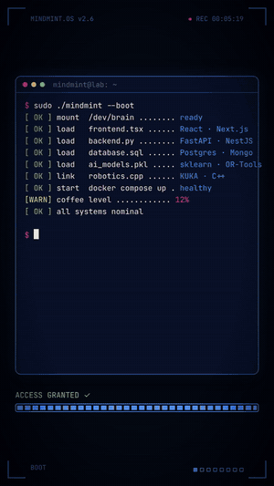
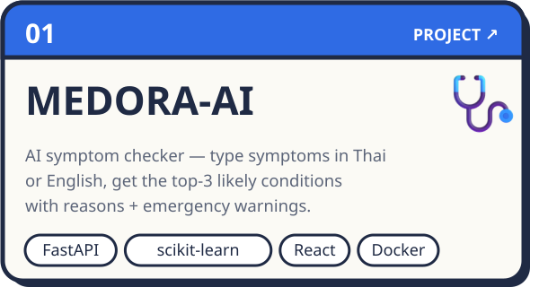
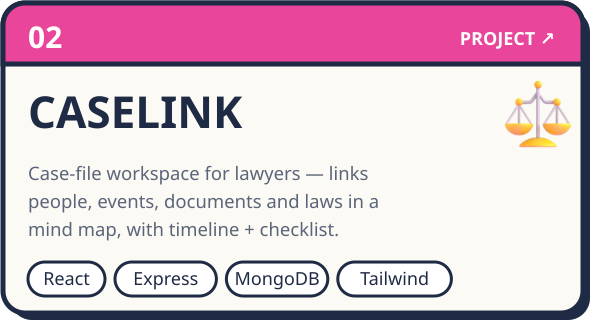
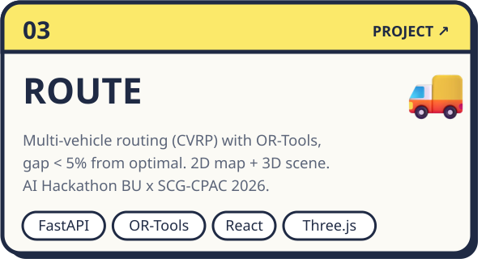
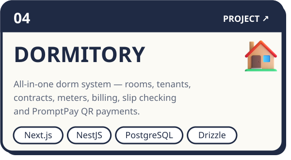

<p align="center">
  
</p>

<p align="center">
  
</p>

<p align="center">
  
  
  
</p>

<br/>


<table>
  <tr>
<td width="62%" valign="top">

**Hi, I'm Thidarat — a.k.a. MINDMINT ✦**
Computer & Robotics Engineering student at **Bangkok University** (Year 4).

I like building things end-to-end — from the screen people tap, to the API behind it, to the code that moves real machines.

```ts
const mindmint = {
  role:      ["Full-Stack Developer", "Robotic Software Engineer"],
  frontend:  ["React", "Next.js", "TypeScript", "Three.js"],
  backend:   ["FastAPI", "NestJS", "Node.js"],
  robotics:  ["KUKA", "C", "C++"],
  languages: { thai: "native", english: "intermediate" },
};
```

</td>
<td width="38%" align="center" valign="top">

</td>
  </tr>
</table>



<table>
  <tr>
    <td width="50%"><a href="https://github.com/NXMMINTT/Medora-AI"></a></td>
    <td width="50%"><a href="https://github.com/NXMMINTT/CASELINK"></a></td>
  </tr>
  <tr>
    <td width="50%"><a href="https://github.com/NXMMINTT/ROUTE"></a></td>
    <td width="50%"><a href="https://github.com/NXMMINTT/Dormitory"></a></td>
  </tr>
</table>



| When | Role | Where |
|:--|:--|:--|
| `Oct 2026 — now` 🟣 | **Google Student Ambassador** · Cohort 2 | Google Student Ambassador Program |
| `Jun 2026 — now` 🟣 | **Robotic Software Engineer (Intern)** · KUKA robot control + full-stack web | DNA Robotics · Pathum Thani |
| `Jun — Aug 2025` | **Full-Stack Developer (Intern)** · ERP modules, RESTful APIs, Agile/Scrum | APT X Co. Ltd. · Bangkok |
| `Freelance` | **Frontend Developer & UX/UI Designer** · Figma prototypes → responsive web | SIB HOK TOR KAO PRODUCTION |
| `2023 — now` 🎓 | **B.Eng. Computer & Robotics Engineering** | Bangkok University |



| | Competition | Result |
|:-:|:--|:--|
| 🎯 | **U-Hackathon 2026** — Flow Summit by U-topia · 24h AI & Web3 | Top 40 finalist |
| 🚚 | **AI Hackathon Route Optimization 2026** — BU × SCG-CPAC · built [ROUTE](https://github.com/NXMMINTT/ROUTE) | Awaiting results |
| 🥈 | **SUMO ROBOT EV3** — Thailand Manual Robot Challenge 2022 | Silver medal |
| 🥇 | **Intermediate Robot Contest (EV3)** — 70th Student Arts & Crafts Fair | Gold medal |
| 🤖 | **Line Tracking Robot Contest** — Northeastern University | Competitor |


<p align="center">
  <b>Frontend</b><br/>
  <br/><br/>
  <b>Backend</b><br/>
  <br/><br/>
  <b>Database · AI · Robotics</b><br/>
  <br/><br/>
  <b>Tools & DevOps</b><br/>
  
</p>



<p align="center">
  
</p>



<p align="center">
  Have an interesting project or want to talk about work? My inbox is open ✦
</p>

<p align="center">
  <a href="mailto:thidarat.workk@gmail.com"></a>
  <a href="https://www.linkedin.com/in/thidarat-tarasi/"></a>
  <a href="https://www.instagram.com/_nxmmint/"></a>
  <!-- When your portfolio site is live, add it here:
  <a href="https://YOUR-PORTFOLIO-URL"></a>
  -->
</p>

<p align="center"></p>
